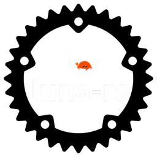

# luna-rs



luna-rs is a Discord bot built to handle audio playback simply and reliably.
It’s written in Rust and designed handle your music queue and plays content
directly in your voice channels.

I started this project because I was frustrated with the state of public music
bots. Many of them have become increasingly unreliable due to YouTube’s
evolving restrictions on third-party API access, and those that do work often
prioritize server-side cost savings by forcing low audio bitrates. luna-rs aims
to solve both by providing a stable, self-hosted alternative that prioritizes
high-fidelity audio output.

It does what it says on the tin—nothing more, nothing less.

---

<!--toc:start-->

- [Configuration](#configuration)
- [Developing with Docker](#developing-with-docker)
  - [Building the Image](#building-the-image)
  - [Running with Docker Compose](#running-with-docker-compose)
  - [Development Workflow](#development-workflow)
- [Production Build](#production-build)
  - [Running the Production Bot](#running-the-production-bot)
- [Observability](#observability)
  - [Spinning Up the Metrics Stack](#spinning-up-the-metrics-stack)
    - [Development with Telemetry](#development-with-telemetry)
    - [Production with Telemetry](#production-with-telemetry)
  - [Accessing Grafana Dashboards](#accessing-grafana-dashboards)
  - [Querying via the Prometheus Web UI](#querying-via-the-prometheus-web-ui)
  - [The Prometheus Exporter Endpoint](#the-prometheus-exporter-endpoint)
- [Limitations and Architecture Notes](#limitations-and-architecture-notes)
<!--toc:end-->

## Configuration

To run the bot, you will need a Discord Bot Token and a YouTube API Key. These
should be stored in a file named `Secrets.toml` located at the root of the
project directory.

Create the file and add your keys as follows:

```toml
# Secrets.toml
DISCORD_TOKEN = "your_discord_bot_token_here"
YOUTUBE_API_KEY = "your_youtube_api_key_here"
```

## Developing with Docker

You don't need to install the Rust toolchain locally if you prefer using Docker.
This is the recommended way to build and run the bot in an isolated environment.

### Building the Image

To build the image locally, run the following command from the project root:

```bash
docker build -t luna-rs-dev .
```

### Running with Docker Compose

The project includes a `compose.yaml file` to handle the container configuration
and networking. To start the bot, simply run:

```bash
docker compose up --build
```

### Development Workflow

If you are actively making code changes and want the bot to recompile
automatically, use the `--watch` flag. This will monitor your local files and
trigger a rebuild whenever you save changes:

```bash
docker compose up --build --watch
```

## Production Build

When you are ready to deploy the bot for actual use, you should build the image
using the `release` profile. This produces a highly optimized, smaller, and
faster binary.

To build the production image, use the `--build-arg` flag from the project root:

```bash
docker build --build-arg BUILD_PROFILE=release -t luna-rs:latest .
```

### Running the Production Bot

The production setup uses two specific services defined in the `compose.yaml` file:

`luna-rs`: The bot service. It uses the optimized production image
(`luna-rs:latest`) built with the `release` profile.

`ytdlp-updater`: A lightweight sidecar container that periodically checks for and
downloads the newest version of `yt-dlp` to a shared volume, ensuring the bot
rarely breaks when YouTube updates its platform.

To run the production pair in the background (detached mode):

```bash
docker compose -f compose.prod.yaml up -d
```

## Observability

`luna-rs` features telemetry tracking out of the box. It instruments its internal
core audio pipelines to track operational health.

Monitoring dependencies are completely optional and live in a dedicated
extension layer: `compose.o11y.yaml`

### Spinning Up the Metrics Stack

To attach the Prometheus and Grafana engine stack, combine your target
environment file with the observability configuration layer using multi-file composition:

#### Development with Telemetry

```bash
docker compose -f compose.yaml -f compose.o11y.yaml up --build
```

#### Production with Telemetry

```bash
docker compose -f compose.prod.yaml -f compose.o11y.yaml up --build
```

### Accessing Grafana Dashboards

Once the composition layer is running, the visualization engine becomes
available natively on your host system:

- URL: `http://localhost:3000` (or `http://your-server-ip:3000` if hosting remotely).

### Querying via the Prometheus Web UI

For raw debugging, ad-hoc calculations, or checking scrape health, you can access
the Prometheus engine directly via its built-in dashboard web interface:

- URL: `http://localhost:9090` (or `http://<your-server-ip>:9090`)

### The Prometheus Exporter Endpoint

The core application implements a standard, text-based raw metrics collector
scraper. If you already maintain an external production monitoring cluster, you
can bypass the local `compose.o11y.yaml` stack entirely and scrape the service
container directly:

- Port: 9000
- Path: `/metrics`
- Endpoint: `http://deployed-bot-ip:9000/metrics`

## Limitations and Architecture Notes

`luna-rs` is strictly designed as a self-hosted, single-instance Discord bot. It
is not built to scale horizontally or run inside a clustered environment (like
Kubernetes pods) due to the following architectural choices:

- In-Memory State Management: The bot tracks active voice sessions, queues, and
  guild (server) states directly in-memory within the application. Because this
  state is not offloaded to a centralized cache (like Redis), running multiple
  instances of the bot would cause fragmented and broken state across different
  servers.

- Inherent Server Affinity: Audio streaming establishes a direct, persistent
  connection between the bot and a guild's voice channel. A single container/pod
  must handle the encoding and streaming pipeline for that specific channel,
  creating a hard server affinity that breaks standard stateless load-balancing
  models.

If you are hosting this for yourself or a few private servers, a single
container deployment is the ideal, low-overhead solution.
